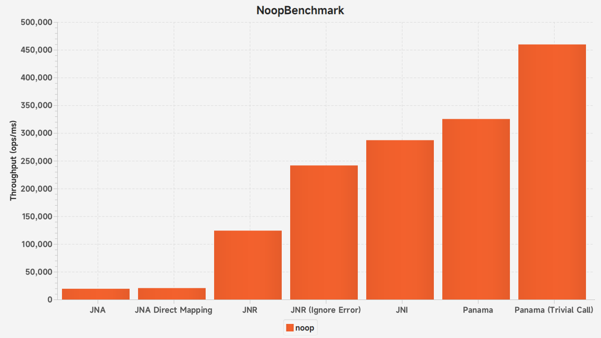
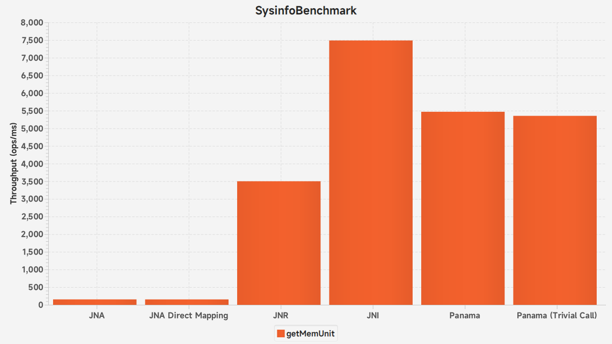
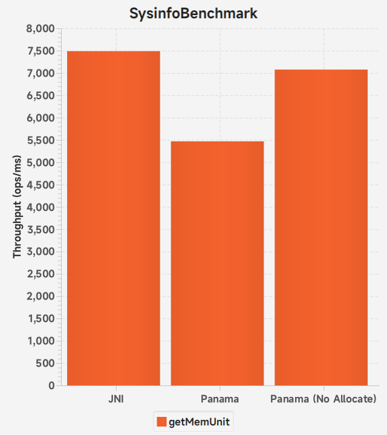
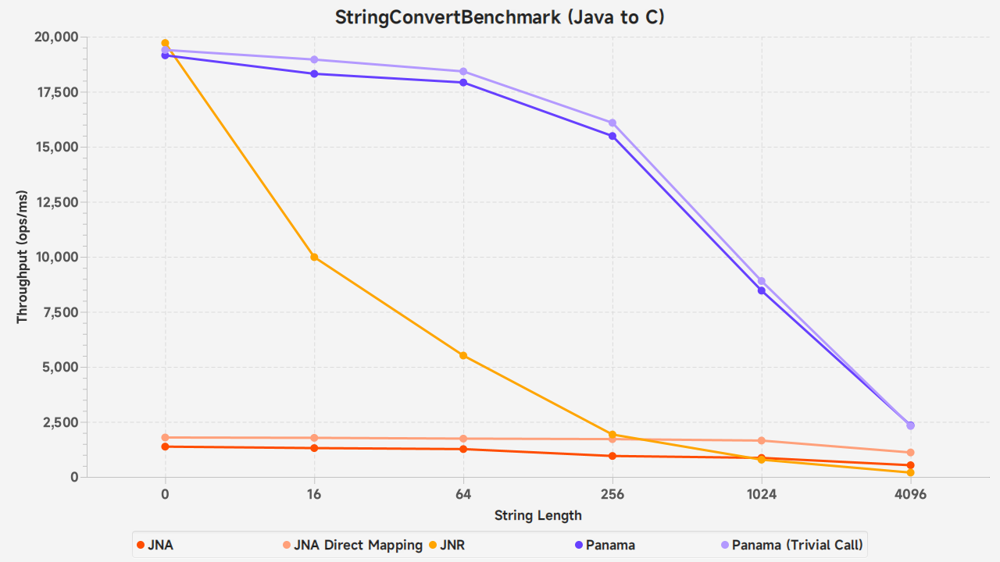
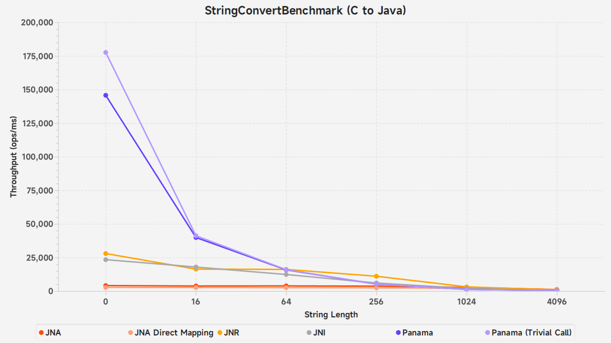
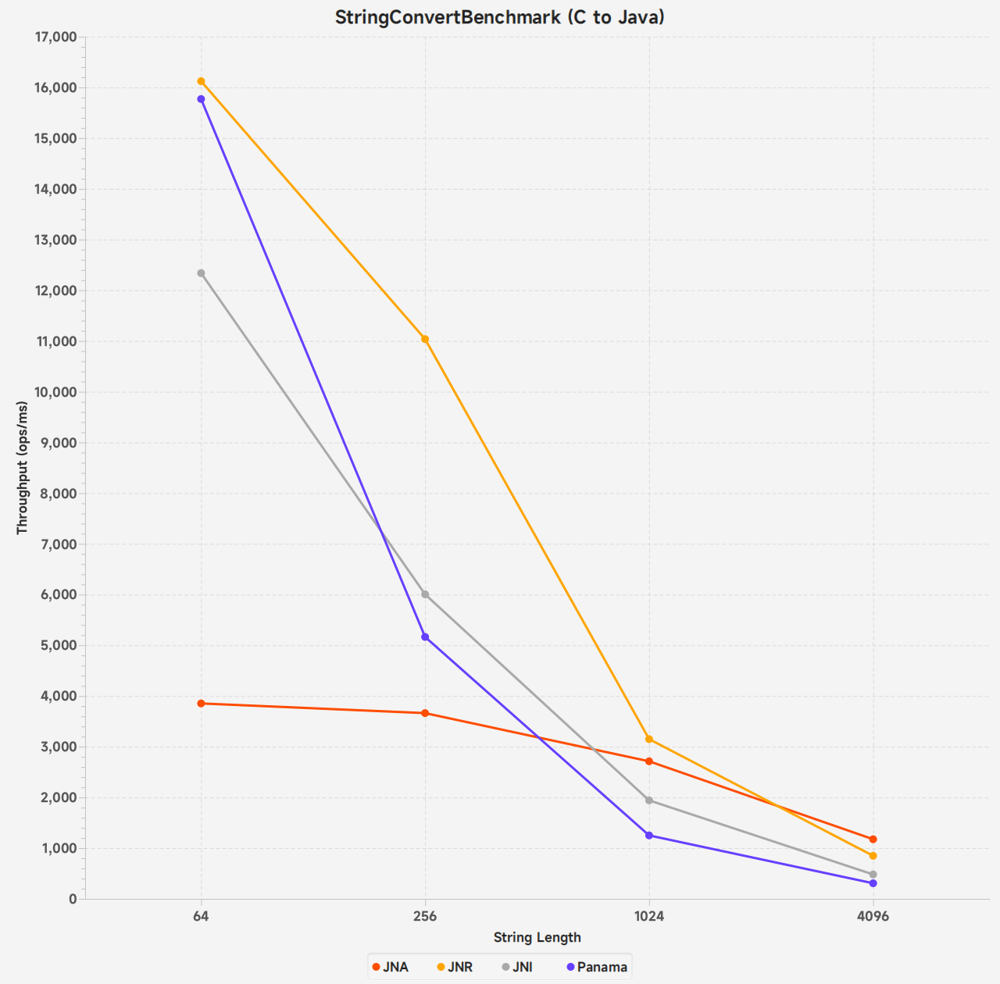
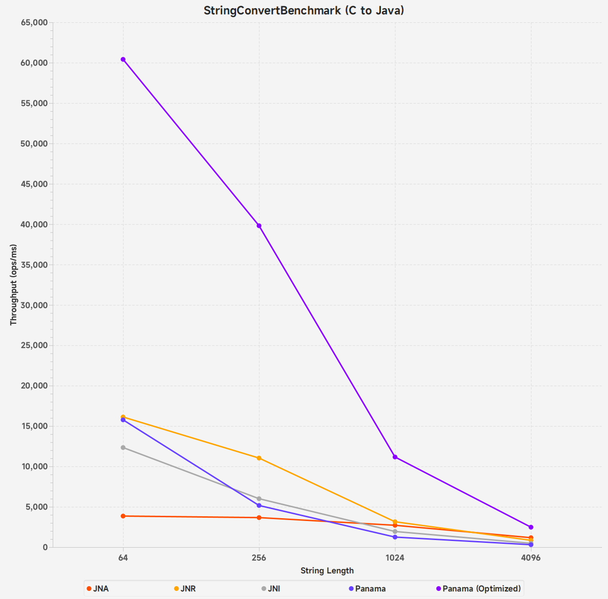
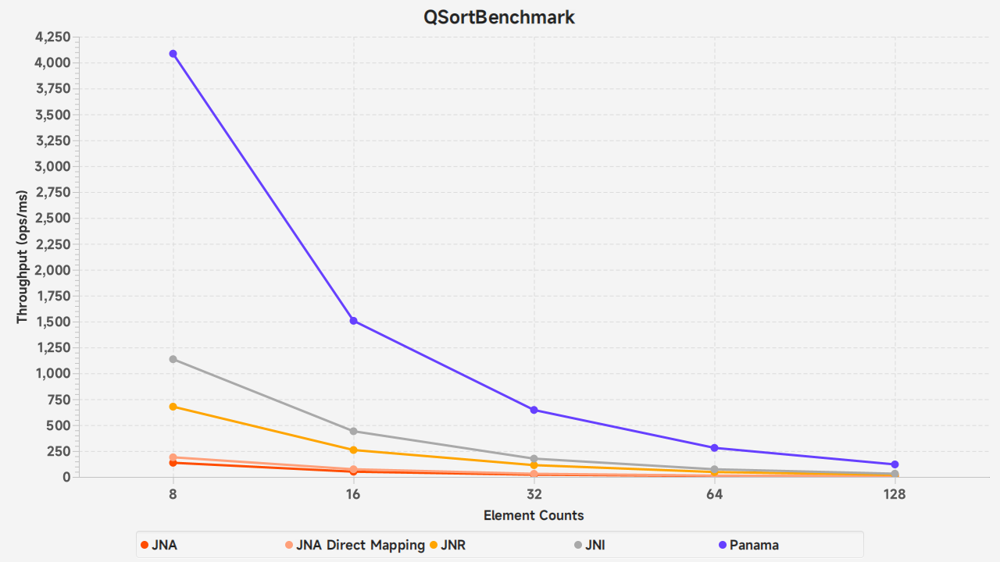

# Java FFI Benchmark

A series of JMH micro benchmarks that compare the performance of invoking foreign functions from Panama, [JNA](https://github.com/java-native-access/jna), [JNR](https://github.com/jnr/jnr-ffi), and JNI.

This benchmark is based on **Java 21**. I built JDK based on [openjdk/panama-foreign@dbddb9e](https://github.com/openjdk/panama-foreign/commit/dbddb9e2b74dd71e54dbb296cdc2bb4375d872e4)<!--, you can get the JDK I built from [here]()-->.

Here are four benchmarks:

* `NoopBenchmark`: Call a C function that has no action.
  This benchmark measures the basic overhead of invoking foreign functions.
* `SysinfoBenchmark`: Call the Linux system function `sysinfo` and get the `mem_unit` from the result.
  This benchmark measures the overhead of allocating structures and fetching field values.
* `StringConvertBenchmark`: Convert Java strings to C-style strings and pass them to foreign functions, 
  and get C-style strings from foreign functions and convert them to Java strings.
* `QSortBenchmark`: Call the C function `qsort` with a Java method as the comparator.
  This benchmark measures the overhead of calling a Java function as a callback in a foreign function.
  

## Benchmark details and results

Environment:

CPU: AMD Ryzen 7 5800X 8-Core @ 16x 4.6GHz
Memory: Dual Channel DDR4 3200 MT/s
System: Ubuntu 22.04.1 (Linux 5.15.0-52-generic)
C Compiler: GCC 9.4.0

The original results of all the tests below can be found in the [data](./data) directory, where the JMH run logs are stored.

### `NoopBenchmark`

This benchmark calls a C function that has no action.

Result:


JNA has a very large overhead for such simple cases, 
its performance is only about 6.7% of JNI, 
and even using [direct mapping](https://github.com/java-native-access/jna/blob/master/www/DirectMapping.md), 
it is still only about 7.2%.

Although JNR also has significant performance losses, 
a significant portion is spent saving the last error.
As long as we annotate the method with `@IgnoreError`, 
it has almost 84% of the performance of JNI, which looks good.

Panama has shown excellent performance in such tests.
By default, it is 13% faster than JNI.
We can also use the `Linker.Option.isTrivial()` option when calling downcallHandle, and Panama's performance reaches 160% of JNI.

Here `isTrivial` is the new linking option introduced in Java 21, and this is how the Panama developers describe it: 

> * We have added support for _trivial_ (or _leaf_) calls - that is native calls whose execution completes very quickly. This option might be useful when calling functions whose total execution time is comparable to that of the overhead of the change of the thread state from Java to native (in JNI, such calls are handled using _critical JNI_).

### `SysinfoBenchmark`

Here is the declaration of the Linux function `sysinfo`:

```c
struct sysinfo {
	  signed long   uptime;		/* Seconds since boot */
	  signed long   loads[3];	/* 1, 5, and 15 minute load averages */
	unsigned long   totalram;	/* Total usable main memory size */
	unsigned long   freeram;	/* Available memory size */
	unsigned long   sharedram;	/* Amount of shared memory */
	unsigned long   bufferram;	/* Memory used by buffers */
	unsigned long   totalswap;	/* Total swap space size */
	unsigned long   freeswap;	/* swap space still available */
	unsigned short  procs;		/* Number of current processes */
	unsigned short  pad;		/* Explicit padding for m68k */
	unsigned long   totalhigh;	/* Total high memory size */
	unsigned long   freehigh;	/* Available high memory size */
	unsigned int    mem_unit;	/* Memory unit size in bytes */
	char _f[20-2*sizeof(unsigned long)-sizeof(unsigned int)];	  /* Padding: libc5 uses this.. */
};

/* Returns information on overall system statistics.  */
extern int sysinfo (struct sysinfo *__info);
```

The `sysinfo` function, like many C functions, accepts a structure pointer through which to pass the result.

In this benchmark, we need to implement a Java method like this:

```java
int getMemUnit();
```

It needs to call the `sysinfo` function, and get the value of the `mem_unit` field from the result of `sysinfo` and return it.

JNA and JNR support mapping a C structure to a Java object, and we used this feature in the benchmark.
View the document for more details:

* [TypeMappings - JNR](https://github.com/jnr/jnr-ffi/blob/master/docs/TypeMappings.md#structs)
* [Using Structures And Unions - JNA](https://github.com/java-native-access/jna/blob/master/www/StructuresAndUnions.md)

For JNI, we only need to pass a local variable pointer to the `sysinfo` function, and then get the field value.

For Panama, we need to create a StructLayout for the `struct sysinfo`, and then get the `VarHandle` of the `mem_unit` field.
However, Java does not support local variables of struct type, so we need to allocate it on heap.

```java
@Benchmark
public int getMemUnitPanama() throws Throwable {
    try (Arena arena = Arena.ofConfined()) {
        MemorySegment info = arena.allocate(sysinfoLayout);
        getMemUnit.invokeExact(info);
        return (int) memUnitHandle.get(info);
    }
}
```

Result:


JNA is still surprisingly slow, and JNR's performance is less than half that of JNI.
This is understandable, given the cost of mapping C structs to Java.

Panama's score is not satisfactory, it has a 15% performance loss compared to JNI.
The reason is obvious: allocating memory on the heap consumes some time.
Here is the result without measuring the memory allocation time:



Here is a shortcoming of Panama: more dynamic memory allocation is required because pointers to local variables cannot be obtained.

To alleviate this problem, you can allocate a large block of memory at one time,
and then divide it into smaller chunks by `SegmentAllocator.slicingAllocator` when needed.

## `StringConvertBenchmark`

This benchmark consists of two tests: Java String to C String and C String to Java String.

### Java String to C String

In this test, we need to convert a Java string of various lengths to a NULL-terminated C-style string and pass it to a C function with no action.

In JNA and JNR, we only need one interface like this:

```java
public interface NativeLib extends Library {
    void acceptString(String str);
}
```

JNA and JNR automatically convert strings to C style.

For Panama, we need to use `Arena::allocateUtf8String`:

```java
try (Arena arena = Arena.ofConfined()) {
    acceptString.invokeExact(arena.allocateUtf8String(testString));
}
```

Result:


JNA is still slow, Panama is still fast.

Surprisingly, JNR becomes slower than JNA for long strings exceeding 1 KiB.
This is probably because the implementation of JNR string conversion is slow.

### C String to Java String

In this test we need to call a C function that returns a NULL-terminated C-style string of various lengths and convert that string to a `java.lang.String`.

For JNI, we use the JNI function `newStringUTF` for the conversion.

JNA and JNR also automatically convert strings. 

For Panama, we need to use the `MemorySegment::getUtf8String` method:

```java
@Benchmark
public String getStringFromNativePanama() throws Throwable {
    return ((MemorySegment) getString.invokeExact(length)).reinterpret(Long.MAX_VALUE).getUtf8String(0);
}
```

Result:


Let's focus on strings longer than 64 and see what happens:


For small strings, JNA trails JNI, JNR, and Panama by a huge margin, which is to be expected.
However, for large strings, JNA surprisingly outperforms all competitors.

I have investigated Panama, JNR, and JNA, and they are all converted in a similar way:

* Find the NULL terminator to determine the length of the string;
* Copy the string to a Java `byte[]`;
* Decode the byte array to `java.lang.String`.

The biggest difference between them maybe that Panama and JNR use loop detection NULL terminators in Java, 
while JNA uses the C standard library function `strlen`.
Perhaps this is the reason why they are so slow.

By optimizing `strlen`, Panama has achieved significant acceleration:



## `QSortBenchmark`

This benchmark call the C function `qsort` with a Java method as the comparator. 
Its purpose is to observe the performance of calling a Java callback function in C.

JNA and JNR provide out of the box delegation features.

The following code uses JNA as a demonstration, and the JNR based code is very similar to it:
```java
public interface JnaLib extends Library {
    interface QSortComparator extends Callback {
        QSortComparator INSTANCE = (a, b) -> Integer.compare(a.getInt(0), b.getInt(0));

        int invoke(Pointer a, Pointer b);
    }
    
    void qsort(Pointer data, long elements, QSortComparator comparator);
}

@Benchmark
public void qsortJna() {
    JNA.qsort(data, length, JnaLib.QSortComparator.INSTANCE);
}
```

For JNI, we cache the `jmethodID` of the method to be called and the global reference of the class in the static variables of C.
The implementation is similar to the following:

```c
static JavaVM *vm;
static jclass  cachedCls;
static jmethodID cachedMethodId;

// The callback function, implementation delegated to Java methods
static int qsortCompare(const void *a, const void *b) {
    JNIEnv *env = NULL;
    (*vm)->AttachCurrentThread(vm, (void **) &env, NULL);

    return (int) (*env)->CallStaticIntMethod(env, cachedCls, cachedMethodId, (jlong) a, (jlong) b);
}

// benchmark function
void JNICALL Java_benchmark_QSortBenchmark_qsort(JNIEnv *env, jclass c, jlong address, jlong elements) {
  if (vm == NULL) {
    vm = /*...*/;
    cachedCls = /*...*/;
    cachedMethodId = /*...*/;
  }
  
  qsort((void *) address, elements, sizeof(jint), qsortCompare);
}
```

The Java implementation of the callback function uses `sun.misc.Unsafe` to get the value from address.

```java
static final Unsafe UNSAFE = /*...*/;
static int qsortCompare(long a, long b) {
    return Integer.compare(UNSAFE.getInt(a), UNSAFE.getInt(b));
}
```

For Panama, we generate an upcall stub for the callback function, and then pass it to the `qsort`.
Please see the [documentation](https://openjdk.org/jeps/442#Upcalls) for more details.

Result:


In this benchmark, the performance of Panama is about 3.5~4 times that of JNI.
This shows the most advantageous scenario of Panama: calling Java callback function in C.
